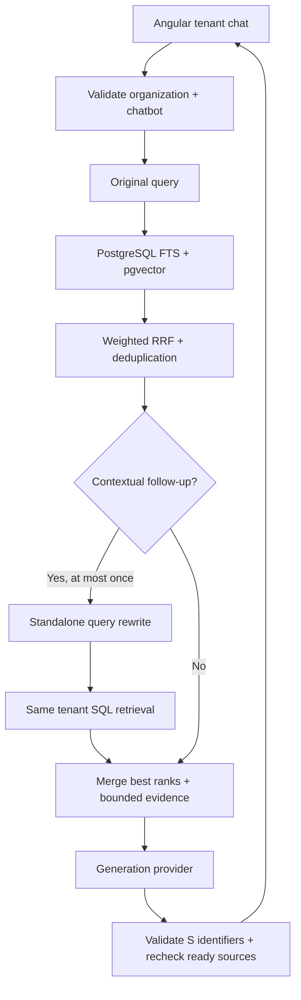

# North Orbital FAQ Assistant

A portfolio-ready website FAQ chatbot built with Angular, Node.js, TypeScript, and a local Ollama model.

> **Important:** North Orbital Community Initiative is a fictional nonprofit created only for this demonstration project. No claims are made about real organizations.

## What this project demonstrates

- responsive Angular chat interface
- Node.js/TypeScript API
- server-side validation
- request rate limiting
- local Ollama integration
- provider abstraction for future hosted models
- grounded answers from tenant-scoped ready PDF/DOCX documents in PostgreSQL
- clickable source references
- short conversation history for follow-up questions
- deterministic fallback for unsupported questions
- timeout and model-unavailable handling
- automated frontend and backend tests
- reproducible 30-question evaluation suite

## Architecture



## Milestone 24: production RAG

Tenant chat now reads **only PostgreSQL customer evidence**, scoped by both `organization_id`
and `chatbot_id`, joined to `documents.status = 'ready'`. It does not load global generated
indexes or mix in the old FAQ corpus. The existing development tenant context is unchanged.

The additive migration `1791100000000_production-rag.js` creates a stored `simple` tsvector,
GIN full-text index, and composite chunk/embedding scope indexes. The existing 1024-dimensional
cosine HNSW index remains. Apply migrations before starting the new backend:

```bash
docker compose config --quiet
docker compose build
docker compose run --rm --no-deps migrate
docker compose up -d --no-build backend worker
```

Lexical search uses OR-combined normalized lexemes, excluding common English question/function
words at query time; `simple` preserves names and non-English terms without English stemming.
PostgreSQL ranks lexical matches and orders semantic neighbors by cosine distance, using only
vectors with the configured provider, model and dimension. Each branch returns at most 30 candidates.

Weighted reciprocal-rank fusion uses `0.85 / (60 + semanticRank)` plus
`0.15 / (60 + lexicalRank)`. Missing branches contribute zero. Across passes, each chunk keeps
its best rank per branch. Stable rank/document/chunk/ID tie-breaks make ordering repeatable.
Exact duplicates and heavily overlapping evidence are removed; distinct neighbors remain.
Default final context is at most five chunks and 12,000 characters, including encoded metadata.

Pass one always uses the original question. Pronouns, elliptical questions, or short questions
with no candidates and recent history can trigger one rewrite. The `QueryRewriter` uses at most
four recent messages of 500 characters each, requests a standalone query of at most 500 characters,
and has an eight-second deadline. The provider abstraction supports a dedicated structured
`{"query":"..."}` response, with an adapter for answer-only providers. Rewriting is never evidence.
A failed/invalid/timed-out rewrite preserves first-pass results. There are at most two retrieval passes.

Generation receives untrusted JSON evidence blocks identified as `S1`–`S8` (five by default).
Only selected, in-scope identifiers can become citations; duplicates collapse, fabricated IDs
are dropped, and an answer with no valid supporting citations becomes a friendly fallback.
After generation the server rechecks source readiness/ownership before responding. Source links
use `/api/organizations/:organizationId/chatbots/:chatbotId/document-sources/:chunkId`, which
repeats the same scoped ready-only SQL lookup and exposes no storage keys. The existing frontend
source contract remains; its request timeout allows two embedding passes, rewrite and generation.

Embedding failures preserve lexical results; either SQL branch can survive a failure in the other.
When both DB branches are unavailable, the existing generic server error is used. Empty evidence
skips generation. Unsupported model answers fall back; malformed output retains the existing 502
convention. Logs contain only IDs, counts, pass numbers, failure labels and timings.

| Variable | Default | Valid range |
| --- | --- | --- |
| `RAG_TOP_K` | 5 | 1–8 |
| `RAG_LEXICAL_CANDIDATES` | 30 | 1–100 |
| `RAG_VECTOR_CANDIDATES` | 30 | 1–100 |
| `RAG_VECTOR_WEIGHT` | 0.85 | 0–1 |
| `RAG_LEXICAL_WEIGHT` | 0.15 | 0–1; weights cannot both be zero |
| `RAG_RRF_K` | 60 | 1–1000 |
| `RAG_MAX_CONTEXT_CHARS` | 12000 | 1000–40000 |
| `RAG_QUERY_REWRITE_ENABLED` | true | true/false |

Configuration is validated by Zod at startup and forwarded by Compose. The existing embedding
model and timeout settings still apply. Native development no longer rebuilds local indexes.

```bash
cd backend
npm run build
npm test
npm run test:db       # local DATABASE_URL; synthetic isolated fixtures, no Ollama needed
npm run evaluate:rag  # focused deterministic unit + PostgreSQL/HTTP evaluation
```

See [Milestone 24 verification](docs/milestone-24-verification.md) for real smoke commands,
recorded results, limitations and deferred work. Tenant UUID scoping preserves the existing
trust model; authenticated tenant authorization remains Milestone 26.

## Historical offline PDF and Word document search

The following v0.2/v0.3 tools remain for local experiments and historical evaluation. They are
**not the production tenant-chat retrieval path**. Private/generated files keep their ignore rules.


Version 0.2.0 adds local document-grounded Q&A for PDF and DOCX files.

The ingestion pipeline:

1. extracts text from trusted local documents
2. preserves PDF page numbers and DOCX section headings
3. creates stable document and chunk IDs
4. splits content into searchable chunks
5. retrieves relevant chunks using deterministic lexical search
6. sends only retrieved context to the configured model
7. validates returned citation IDs before exposing them to the user

Citation behavior:

- PDF sources cite the page number
- DOCX sources cite the section heading

Example citations:

```text
North Orbital Digital Access Program Guide · Page 1
North Orbital Volunteer Handbook · Orientation
```
## Historical local hybrid retrieval

Version 0.3.0 upgrades document search from lexical-only retrieval to hybrid retrieval.

The retrieval pipeline is:

```text
User question
    |
    +--> lexical document search
    |
    +--> qwen3-embedding:0.6b query embedding
              |
              v
         semantic search
              |
              v
     hybrid deterministic reranking
              |
              v
        top document chunks
              |
              v
         qwen3.5:9b
              |
              v
     server-side citation validation
```

Hybrid retrieval combines two complementary signals:

- **lexical retrieval** for exact terms, names, numbers, and wording
- **semantic retrieval** for meaning, paraphrases, and related language

Semantic vectors are generated locally through Ollama and stored in:

```text
documents/generated/semantic-index.json
```

Generated indexes remain local and are not committed.

### Build the indexes

```bash
cd backend
npm run documents:hybrid-index
```

### Test hybrid retrieval directly

```bash
npm run documents:hybrid-search -- \
  "How much time am I allowed to use one of the computers?"
```

### Hybrid evaluation

With a compatible legacy evaluation server (this script does not target the current tenant API):

```bash
npm run evaluate:hybrid
```

The v0.3.0 evaluation contains 14 structural cases covering:

- semantic paraphrases
- exact document facts
- negative-answer grounding
- irrelevant questions
- lexical false positives
- validated document citations

The recorded v0.3.0 verification run passed all 14 structural checks.

### Local models

The default local models are:

```text
Generation: qwen3.5:9b
Embeddings: qwen3-embedding:0.6b
```

If semantic retrieval is unavailable at runtime, document retrieval falls back to the existing lexical search instead of making the chatbot unavailable.

## Milestone 23: asynchronous production document ingestion

Uploads now follow a separate, persistent pipeline:

```text
Tenant-scoped multipart API → private S3 object → documents(pending) + PostgreSQL job(queued)
  → separate worker → download/checksum → PDF/DOCX extraction → PDF quality/OCR
  → existing chunker → bounded Ollama embeddings → atomic PostgreSQL finalization
  → document ready + job succeeded
```

The API returns **202 before extraction or embedding**. Documents and jobs survive API/worker
restarts. Milestone 24 now retrieves these ready PostgreSQL chunks through tenant chat;
the ingestion pipeline and its retries/OCR behavior remain unchanged.

### Local services

Use Node 22.22.3+ for native builds/tests and Docker Compose for the complete stack:

```bash
docker compose config --quiet
docker compose build
docker compose up -d
docker compose ps -a
```

| Service | Host access | Purpose |
| --- | --- | --- |
| postgres | `127.0.0.1:55432` | PostgreSQL 17 + pgvector |
| migrate | none; exits 0 | Runs pending node-pg-migrate migrations |
| backend | `http://127.0.0.1:3001` | Existing chat and new document APIs |
| minio | `http://127.0.0.1:59000` | S3-compatible development storage |
| MinIO console | `http://127.0.0.1:59001` | Development object browser |
| minio-init | none; exits 0 | Idempotently creates a private bucket with `mc` |
| worker | no host port | Durable job polling, extraction, OCR and embeddings |

Port 3000 remains available to the existing outreach agent. Both application services wait
for a healthy database, successful migrations and successful bucket initialization. PostgreSQL
and MinIO use named volumes; do not remove these volumes to restart services.

MinIO community now uses [source-only distribution](https://github.com/minio/minio#source-only-distribution).
`docker/minio.Dockerfile` builds pinned upstream MinIO and `mc` releases, avoiding unavailable
prebuilt Docker Hub/Quay images. The first build downloads Go dependencies and takes longer;
subsequent builds use the Docker cache. MinIO credentials in Compose and example env files
are **development-only**, and the bucket has no anonymous access.

Ollama runs natively on macOS. Containers use `http://host.docker.internal:11434` with
`qwen3-embedding:0.6b` (1024 dimensions); generation remains `qwen3.5:9b`. Ensure both models
are installed in your local Ollama instance. No Ollama container is added.

### Upload and status APIs

Use an existing organization and its chatbot (the existing organization/chatbot creation APIs
remain available). Set the following shell variables to their UUIDs:

```bash
ORGANIZATION_ID=your-organization-uuid
CHATBOT_ID=your-chatbot-uuid
DOCUMENT_API="http://127.0.0.1:3001/api/organizations/$ORGANIZATION_ID/chatbots/$CHATBOT_ID/documents"
curl -fsS -F 'file=@documents/samples/north-orbital-digital-access-guide.pdf' "$DOCUMENT_API"
curl -fsS -F 'file=@documents/samples/north-orbital-volunteer-handbook.docx' "$DOCUMENT_API"
curl -fsS "$DOCUMENT_API?limit=50&offset=0"
DOCUMENT_ID=returned-document-uuid
curl -fsS "$DOCUMENT_API/$DOCUMENT_ID"
curl -fsS -X POST "$DOCUMENT_API/$DOCUMENT_ID/retry"
```

- Accepts exactly one multipart `file`, PDF or DOCX, up to **20 MiB** by default
  (`UPLOAD_MAX_BYTES`, configurable up to 100 MiB). Additional fields/files are rejected.
- Validates byte signatures and matching extension; DOCX also requires Word ZIP package parts
  and its content type. Encrypted/macro ZIP packages, unsafe archive paths, excessive archive
  expansion and empty files are rejected. A syntactically corrupt PDF can pass the signature
  check and subsequently fail extraction with a safe status message.
- Original filenames are sanitized display metadata. Object keys use only validated tenant
  UUIDs, a generated document UUID and `source.pdf`/`source.docx`. SHA-256 verifies downloaded
  bytes before processing. Temporary files are removed after each request/attempt.
- Upload/get/retry return `{ "document": { ... } }`; list returns
  `{ "documents": [...], "limit": 50, "offset": 0 }`. Responses contain safe metadata,
  status, error message, counts and timestamps, without storage keys, internal URLs or contents.
- Invalid requests return 400, wrong-tenant/missing resources 404, invalid retry states 409,
  excessive size 413 and unsupported types 415. Unexpected errors return a generic 500.

Tenant checks follow the existing Milestone 22 organization/chatbot API conventions. Composite
foreign keys additionally enforce ownership for jobs, chunks and embeddings. These routes
retain the project's existing trust model: tenant UUID routing is not user authentication;
production access must be protected by the application's authenticated tenant authorization layer.

### Lifecycle, retries and OCR

Document states are `pending → processing → ready`. On a retryable failure the document
returns to `pending` with a safe reason; the job returns to `queued`. After the final failed
attempt both document and job are `failed`. Manual retry accepts only an owned failed document,
resets processing metadata and creates a new job with a fresh attempt budget. Previous jobs
remain available for operational history. A partial unique index prevents concurrent active jobs.

`INGESTION_MAX_ATTEMPTS` defaults to 3. Backoff starts at 1 second and doubles to a maximum of
5 minutes. `INGESTION_POLL_INTERVAL_MS` defaults to 1000. Workers use `FOR UPDATE SKIP LOCKED`,
heartbeat at one third of `INGESTION_STALE_AFTER_MS` (default 5 minutes), recover stale locks,
and fence finalization by worker identity and attempt number. A stale final attempt becomes
failed; earlier stale attempts are retried. Shutdown stops new claims and finishes the current
job. If forcibly terminated after Compose's grace period, stale recovery resumes the work.

PDF quality requires at least 80 letters/numbers overall and at least 40 on half of the pages.
Blank pages count toward the denominator. Healthy text PDFs bypass OCR. Poor PDFs use OCRmyPDF
when `OCR_ENABLED=true`, then run the existing extractor and quality check again. OCR runs
with fixed argument arrays, one OCR process job, no shell interpolation, discarded command
output and a timeout that kills the subprocess group. DOCX never uses OCR. If OCR is disabled,
fails, times out or yields insufficient text, ingestion follows the normal retry policy.
The heuristic can classify very short PDFs as insufficient; the default OCR language is English.

The HTTP image stays lean. The worker target installs and verifies Bookworm OCRmyPDF,
Tesseract English and Poppler during its build. `OCR_COMMAND` and `OCR_TIMEOUT_MS` configure
the command and timeout (default 180 seconds). Native development defaults OCR to disabled;
Compose enables it in the worker image.

Chunks retain deterministic ordering, PDF page numbers and DOCX section/block metadata.
Token counts remain null because the existing chunker counts words, not model tokens.
Embedding requests have bounded concurrency (`INGESTION_EMBEDDING_CONCURRENCY`, default 2),
and every vector must contain 1024 finite numbers. Extraction/OCR/embedding happen outside
transactions. Chunk replacement, embedding insertion, ready metadata and job completion commit
in one transaction; failures cannot leave a ready document or duplicate chunk/vector rows.

### Native worker and production storage

Copy `backend/.env.example` to an untracked `backend/.env` and adjust it for your environment.
Keep credentials out of version control. For native processes use MinIO at port 59000 and
PostgreSQL at port 55432; Compose overrides these with internal service names.

```bash
cd backend
npm ci
npm run migrate -- up
npm run build
npm start                  # API, in one terminal
npm run worker             # worker, in another terminal
# Or: npm run worker:dev
```

Production uses the same AWS SDK v3 adapter with a private S3-compatible bucket. Set
`OBJECT_STORAGE_BUCKET` and `OBJECT_STORAGE_REGION`; use `OBJECT_STORAGE_ENDPOINT` and
`OBJECT_STORAGE_FORCE_PATH_STYLE` when required by another provider. For AWS S3 omit the
endpoint and both static credentials to use the standard IAM credential provider chain.
Alternatively configure both `OBJECT_STORAGE_ACCESS_KEY` and `OBJECT_STORAGE_SECRET_KEY`
through your secret manager. Bucket provisioning is external in production. Object operations
have `OBJECT_STORAGE_TIMEOUT_MS` timeouts. Best-effort cleanup deletes an uploaded object when
persistence fails; a crash between object upload and DB commit can leave an orphan that requires
storage lifecycle/reconciliation tooling. Database deletion is not a storage deletion API.

Worker logs include IDs, statuses, durations and counts. Provider, OCR, parser and SQL errors
are mapped to fixed safe summaries; document text, vectors and uploaded bytes are not logged.

### Verification

```bash
cd backend
npm run build
npm test                    # Fakes for storage, OCR and embedding; no external services
npm run test:db             # DATABASE_URL required; existing tests plus isolated ingestion schema
cd ../frontend
npm run build
npm test -- --watch=false
```

The database integration suite creates and removes its own temporary schema, runs actual
migrations there, and tests concurrent claiming, lease fencing, ownership constraints,
backoff, stale recovery, manual retry, idempotency and transaction rollback. It does not
consume jobs in your application's public schema.

Optional real scanned-PDF OCR verification (from the repository root):

```bash
docker compose run --rm --no-deps \
  -v "$PWD/backend/scripts:/app/backend/scripts:ro" \
  -v "$PWD/documents/samples:/app/documents/samples:ro" \
  worker node scripts/verify-ocr.mjs
```

Or run `npm run test:ocr` from `backend` when OCRmyPDF, Poppler, Python 3 and Pillow are installed
natively. The check rasterizes a public sample into a temporary image-only PDF, verifies that
normal extraction is insufficient, runs OCR, verifies recovered text/page metadata, then cleans
up. Private and generated documents are never modified.

Full opt-in API → MinIO → worker → Ollama → PostgreSQL verification:

```bash
docker compose run --rm --no-deps \
  -v "$PWD/backend/scripts:/app/backend/scripts:ro" \
  -v "$PWD/documents/samples:/app/documents/samples:ro" \
  worker node scripts/verify-ingestion.mjs
```

This requires the running Compose stack and native Ollama. It checks PDF, DOCX and scanned
PDF ingestion, stored bytes, vector dimensions, terminal failures, manual retry and wrong-tenant
access. It creates synthetic tenants and removes its own rows/objects afterward.

## Milestones 25–26: public widget and secure administration

The public customer interface now uses random `pub_…` chatbot IDs, exact allowed origins and the existing tenant-scoped PostgreSQL RAG pipeline. Existing chatbots migrate with public access **disabled**. All internal organization/chatbot/document/chat/source APIs now require a database-backed authenticated session, organization membership and CSRF protection for mutations.

Start local security configuration once with `cd backend && npm run security:init`, then rebuild/start Compose. Bootstrap an owner using `npm run auth:create-owner` with password input on stdin. Enable a chatbot and set its allowed origins through authenticated APIs before embedding:

```html
<script defer src="https://CHAT_HOST/widget/v1.js"
        data-chatbot="pub_REPLACE_WITH_PUBLIC_ID"></script>
```

The lightweight Shadow DOM widget is built inside the Docker image. The Angular demo uses public-ID/API-origin meta tags in `frontend/src/index.html`; it no longer requires organization/internal chatbot UUIDs. Origin restrictions prevent normal unauthorized browser embedding but are **not authentication**; public IDs are not secrets and shared database rate limits remain necessary.

See [the combined milestone verification and operations guide](docs/milestone-25-26-verification.md) for routes, branding, owner/admin/member policy, session/CSRF design, configuration, exact-origin CORS, protected metrics, audit events, proxy setup, backup/temporary-restore commands, tests and live smoke procedures. Earlier unauthenticated API examples in the historical milestone sections require session/CSRF headers now. Public conversations remain request-time only; billing and commercial onboarding are deferred.
