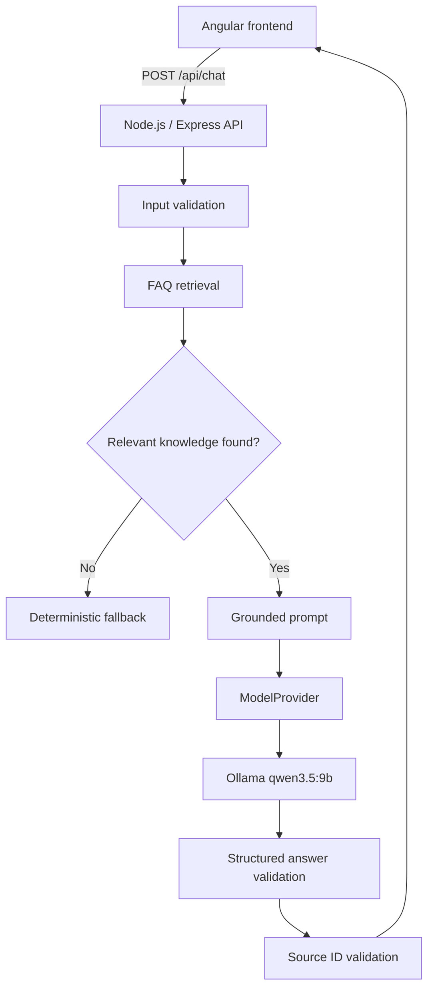

# North Orbital FAQ Assistant

A portfolio-ready website FAQ chatbot built with Angular, Node.js, TypeScript, and a local Ollama model.

> **Important:** North Orbital Community Initiative is a fictional nonprofit created only for this demonstration project. No claims are made about real organizations.

## What this project demonstrates

- responsive Angular chat interface
- Node.js/TypeScript API
- server-side validation
- request rate limiting
- local Ollama integration
- provider abstraction for future hosted models
- grounded answers from a controlled FAQ knowledge base
- clickable source references
- short conversation history for follow-up questions
- deterministic fallback for unsupported questions
- timeout and model-unavailable handling
- automated frontend and backend tests
- reproducible 30-question evaluation suite

## Architecture



## PDF and Word document search

Version 0.2.0 adds local document-grounded Q&A for PDF and DOCX files.

The ingestion pipeline:

1. extracts text from trusted local documents
2. preserves PDF page numbers and DOCX section headings
3. creates stable document and chunk IDs
4. splits content into searchable chunks
5. retrieves relevant chunks using deterministic lexical search
6. sends only retrieved context to the configured model
7. validates returned citation IDs before exposing them to the user

Citation behavior:

- PDF sources cite the page number
- DOCX sources cite the section heading

Example citations:

```text
North Orbital Digital Access Program Guide · Page 1
North Orbital Volunteer Handbook · Orientation
```
## Hybrid RAG document retrieval

Version 0.3.0 upgrades document search from lexical-only retrieval to hybrid retrieval.

The retrieval pipeline is:

```text
User question
    |
    +--> lexical document search
    |
    +--> qwen3-embedding:0.6b query embedding
              |
              v
         semantic search
              |
              v
     hybrid deterministic reranking
              |
              v
        top document chunks
              |
              v
         qwen3.5:9b
              |
              v
     server-side citation validation
```

Hybrid retrieval combines two complementary signals:

- **lexical retrieval** for exact terms, names, numbers, and wording
- **semantic retrieval** for meaning, paraphrases, and related language

Semantic vectors are generated locally through Ollama and stored in:

```text
documents/generated/semantic-index.json
```

Generated indexes remain local and are not committed.

### Build the indexes

```bash
cd backend
npm run documents:hybrid-index
```

### Test hybrid retrieval directly

```bash
npm run documents:hybrid-search -- \
  "How much time am I allowed to use one of the computers?"
```

### Hybrid evaluation

With the backend running:

```bash
npm run evaluate:hybrid
```

The v0.3.0 evaluation contains 14 structural cases covering:

- semantic paraphrases
- exact document facts
- negative-answer grounding
- irrelevant questions
- lexical false positives
- validated document citations

The recorded v0.3.0 verification run passed all 14 structural checks.

### Local models

The default local models are:

```text
Generation: qwen3.5:9b
Embeddings: qwen3-embedding:0.6b
```

If semantic retrieval is unavailable at runtime, document retrieval falls back to the existing lexical search instead of making the chatbot unavailable.
